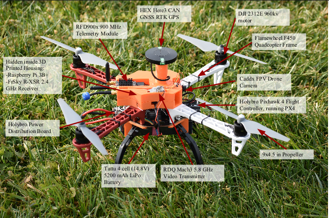

# Hardware
SOLIDWORKS files and general hardware setup

**Quadditch Copter**

Parts List

- [Frame Kit](https://www.amazon.com/DJI-Flame-Wheel-F450-ARF/dp/B00G4A2RBU) 
- [Pixhawk 4 AutoPilot](https://docs.px4.io/master/en/flight_controller/pixhawk4.html)
- [Raspberry Pi 3b+](https://www.raspberrypi.com/products/raspberry-pi-3-model-b-plus/)
- [Lipo Battery](https://www.getfpv.com/lumenier-n2o-5200mah-6s-120c-lipo-battery.html?afid=aVlOV0hBdmd6THc9&in-stock=1&gclid=CjwKCAjwopWSBhB6EiwAjxmqDTtkMAoWAjR4OPhC20Z10pFSP7TL0MlhJi3XZG94vtunalAG9tURbBoCzWQQAvD_BwE)
- [RTK GPS](https://irlock.com/products/here-3-here-rtk-base-m8p-combo?_pos=1&_sid=b2b8338c6&_ss=r)
- [Telemetry Radio](https://irlock.com/collections/telemetry/products/rfd900-telemetry-bundle)
- [FPV Camera](https://www.racedayquads.com/products/caddx-ratel-2-1200tvl-16-9-4-3-ntsc-pal-micro-fpv-camera?currency=USD&variant=32252553461873&gclid=CjwKCAjwopWSBhB6EiwAjxmqDcY6xkVY6ziV0bNjD42cZLxOCNjk_HoEvTXMwiVjjCei-xruu7opWBoC1v0QAvD_BwE)
- [Video Transmitter](https://www.racedayquads.com/products/rdq-mach-3-video-transmitter-25-1000mw-5-8ghz-vtx-mmcx?currency=USD&variant=17876578009201&gclid=CjwKCAjwopWSBhB6EiwAjxmqDUHuWwQMmS51TPkJjZPIS79uBSXJd4FV2JvyHOB76OZjNJpm98K-6hoCBnAQAvD_BwE)
